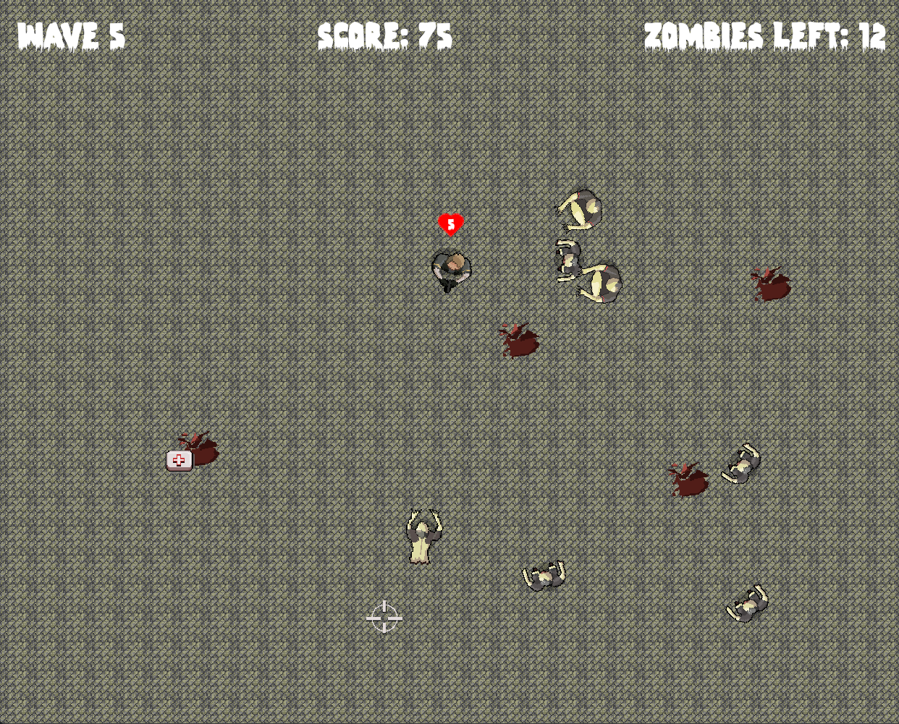

# Zombie Arena

Slightly modified Rust version of the C++ game Zombie Arena made by @PacktPublishing

## Credits

[John Horton and Packt](https://github.com/PacktPublishing/Beginning-Cpp-Game-Programming-Second-Edition): Original c++ version and game assets  
[Remix Icon](https://remixicon.com/icon/heart-fill): heart icon  
[Zombies icons created by kosonicon - Flaticon](https://www.flaticon.com/free-icons/zombies): Game icon  
[bevy cheatbook](https://bevy-cheatbook.github.io/): Several code snippets  
